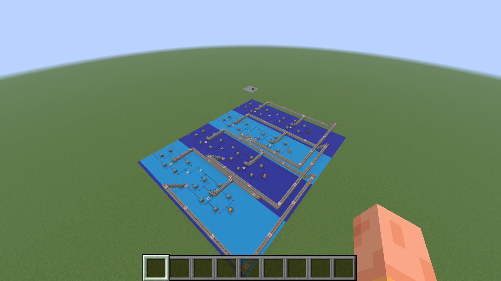

# minecraft redstone

i started this while working on a minecraft version of [adam majmudar's tiny-gpu](https://github.com/adam-maj/tiny-gpu). i wanted codex to help build and debug the redstone without sending it a full screenshot every turn.

the bridge exposes blocks, inventories and player state through mcp. a local adapter sends selected fields and changes, with screenshots when needed. it also adds named signals and buses, tick recordings, local test runs, and build previews with backups and undo. the [command centre](docs/COMMAND_CENTRE.md) controls ticks, console commands, render settings and world loading directly. independent screenshots need a second spectator client.

the gpu now has a 12,872-block register file that passed 26,688 checks in minecraft. the full two-core, eight-lane layout is still being designed offline. [current results and limits](docs/VERIFICATION.md).

[](https://jsun.ai/minecraft-mcp/)

[the demo](https://jsun.ai/minecraft-mcp/) · [results](docs/VERIFICATION.md)

## running it

you'll need node 22+, minecraft java 26.3 and java 25.

```sh
git clone https://github.com/jsunco/minecraft-redstone.git
cd minecraft-redstone
npm ci --ignore-scripts
npm test
```

then [build the fabric bridge](bridge/README.md) and follow the [setup notes](docs/MINECRAFT_SETUP.md). [building](docs/BUILD_TOOLS.md), [signals](docs/CIRCUIT_TOOLS.md) and [tests](docs/TEST_RUNNER.md) cover the rest.

built on [chapmanjw's fabric mcp server](https://github.com/chapmanjw/minecraft-java-fabric-mcp-server). its mit license and pinned source are in [bridge/](bridge/).
