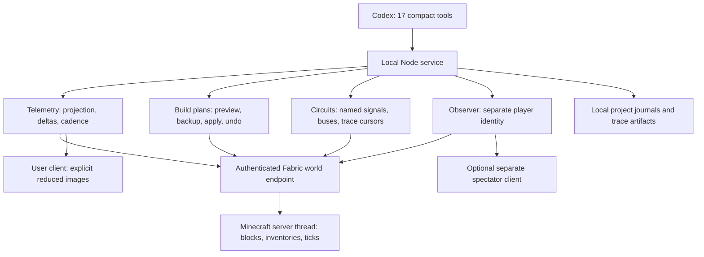

# Architecture

The assistant requests observations and construction operations. Minecraft owns the actual world state and performs the redstone computation.

## Data paths

| Request | What crosses into the conversation | What stays local |
|---|---|---|
| Ordinary observation | Selected snapshot, field deltas, or freshness/status | Full upstream reading, caches, credentials |
| Circuit observation | Named signal bits, bus values, tick and assertions | Position mapping and protocol validation |
| Tick recording | Bounded transition summary and explicit coverage/gap state | Complete retrieved JSONL pages and cursor |
| Construction | Plan summary, material counts, validation/conflict result | Exact block baseline, structure backup reference |
| Image | One explicitly requested reduced frame and viewpoint metadata | Unrequested frames; no continuous screenshot stream |

## Ownership and consistency

- The Node runner serializes stateful tool calls. Independent telemetry reads have bounded concurrency; identical requests share one read.
- Minecraft executes native batch reads as one server-thread task and records traces at the end of server ticks. These are different observation phases. Multiple tools are not one atomic transaction.
- A server session UUID binds plans and traces to the current world lifecycle. Saved state is never automatically replayed into a new session.
- Failed, deferred, unloaded and unknown observations remain distinct. Buffer overflow cannot establish what happened in missing ticks.
- The observer controller targets only an explicitly attached distinct spectator UUID. The user client is never silently substituted.
- Project state lives in the configured `.minecraft-assistant/` directory. Credentials live in private game configuration files and are passed only in endpoint authorization headers.

## Source map

| Files | Responsibility |
|---|---|
| `scripts/telemetry-server.mjs` | Compact MCP catalog and shared service orchestration |
| `scripts/telemetry-core.mjs`, `telemetry-service.mjs` | Projection/diffing, bridge transport, schema cache and observation scheduling |
| `scripts/build-service.mjs` | Bounded construction plans, backup checks, readback and recovery |
| `scripts/circuit-service.mjs` | Signal decoding, bus assertions and native recorder lifecycle |
| `scripts/observer-service.mjs` | Separate-client attachment, movement and frame checks |
| `scripts/configure-local.mjs`, `setup-minecraft.mjs` | Local configuration and isolated launcher setup |
| `bridge/vendor/` | Pinned upstream source plus the 26.3 port and native extensions |

See [verification](VERIFICATION.md) for the distinction between automated evidence and pending in-game acceptance.
