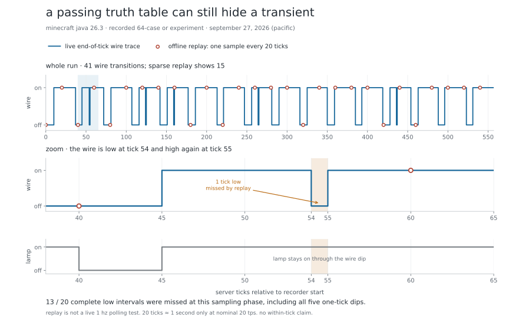

# A passing truth table can still hide a transient

The live OR circuit passed all 64 settled-output cases. Its tick recording nevertheless contains five one-tick wire dips. This is why a final-state assertion and a timing trace answer different questions.



## What was recorded

This analyzes the **earlier 64-case OR experiment**, not a new circuit run: September 27, 2026 Pacific time, **00:53:12–00:53:40 UTC on September 28**. Minecraft Java 26.3 ran the physical redstone circuit in the Fabric lab. Cases cycled through two lever inputs and waited eight server ticks before checking the output wire and lamp. The [verification record](VERIFICATION.md) documents the 64/64 pass and input restoration.

The native recorder returned **56 change entries** across relative ticks **0–557**, with no reported gaps, dropped entries or missed sampling ticks. Tick 0 is the initial server-task snapshot; later changes are sampled at the end of server ticks. The [anonymous dataset](assets/timing-trace.json) preserves each change as wire power, binary wire state and lamp state. Coordinates, identities and absolute game ticks are omitted.

At relative tick **54**, wire power changed from **12 to 0**. At tick **55**, it returned to **12**. The lamp stayed lit through that dip. The runner journal places this at the case changing the requested inputs from `a=1, b=0` to `a=0, b=1`. The runner writes inputs sequentially, so this is a transient during stimulus application, not evidence that OR produces the wrong settled result. It illustrates why a passing truth table does not prove glitch-free switching.

The trace proves one low tick-boundary sample between high samples. It does **not** measure an exact 50 ms physical pulse or its sub-tick edges. One game tick is 50 ms only at nominal 20 TPS; no wall-clock pulse measurement was made.

## Replay: what slower reads would show

We reconstructed the recorded states at relative ticks `0, 20, 40, …, 540`: **28 samples** at a fixed 20-tick cadence, corresponding to nominal 1 Hz at 20 TPS. These are **offline samples of this trace**, not a separately executed live polling benchmark. The replay assumes a read at each chosen tick sees that tick’s recorded state; actual HTTP reads can occur in a different server phase.

A complete low interval begins at a recorded falling edge and ends at its next rising edge. An interval is missed when none of the replay ticks lies in `[fall, rise)`. The initially low state has no recorded falling edge and is excluded from that interval count.

| Observation | Full tick trace | Every-20-tick replay, phase 0 |
| --- | ---: | ---: |
| Binary wire state changes | 41 | 15 |
| Complete wire-low intervals | 20 | 7 sampled; **13 missed** |
| One-tick wire-low intervals | 5 | **All 5 missed** |

At ticks 40 and 60 the replay reports low then high; it cannot reveal the additional high → low → high sequence at 45, 54 and 55. The lower panel shows why watching only the lamp would also hide this particular wire dip.

The exact count depends on sampling phase. Repeating the reconstruction for all 20 integer phases misses **11–15 of the 20 complete low intervals**; phase 0 misses 13. Even the best of those phases misses three of the five one-tick dips. The dataset contains every phase’s count, so the result is not presented as a universal miss rate.

## What this demonstrates

The recorder preserves tick-boundary changes locally while the assistant is busy or reading less often. Compact deltas alone cannot recover events that were never observed. The test runner can verify settled logic, and the trace can expose transitions between those checks. Both matter for later clocks, registers and arithmetic circuits.

This is an instrumentation case study, not an automatic circuit fault diagnosis, a competitor benchmark, or proof of vanilla behavior without the helper. A trace can still miss transitions entirely within one tick, and an overflowing trace must report incomplete coverage. Other projects may implement comparable recording; this experiment does not establish that they cannot.

## Recalculate the replay

The published JSON contains all relative state changes, the replay samples, complete low intervals and phase sensitivity. A sample’s state is the latest recorded change at or before its tick. For example:

```python
import json
from pathlib import Path

d = json.loads(Path("docs/assets/timing-trace.json").read_text())
points = d["state_changes"]
samples = range(0, d["covered_end_tick"] + 1, 20)
wire = [next(p["wire_high"] for p in reversed(points)
             if p["tick"] <= tick) for tick in samples]
missed = sum(not any(p["start"] <= t < p["end_exclusive"]
                     for t in samples)
             for p in d["complete_wire_low_intervals"])
assert missed == 13
assert sum(a != b for a, b in zip(wire, wire[1:])) == 15
```

The SVG/PNG waveform was plotted from that dataset with Matplotlib. Step lines describe the reconstructed tick samples; they do not claim continuous visibility between them.
